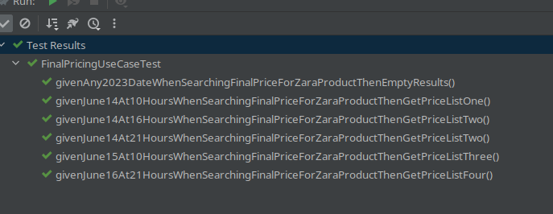
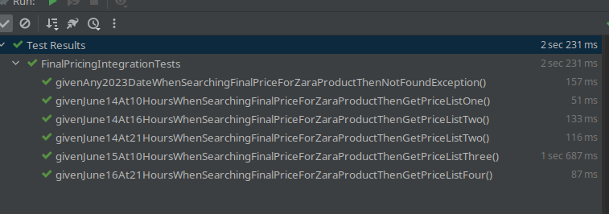
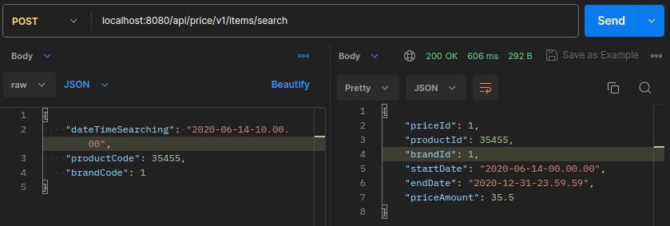
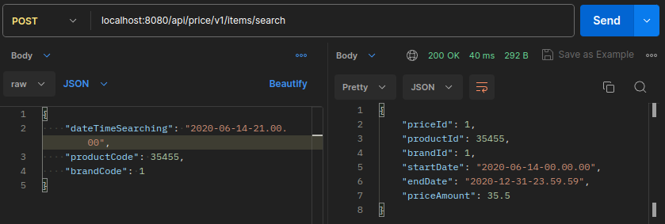
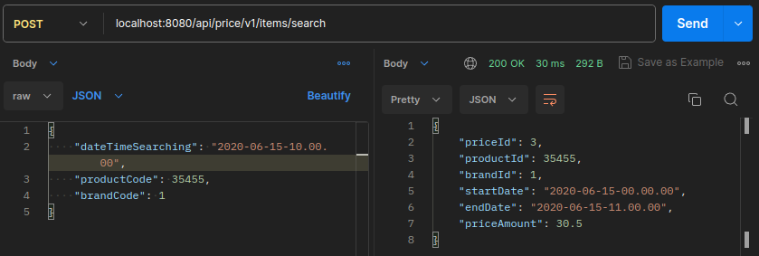
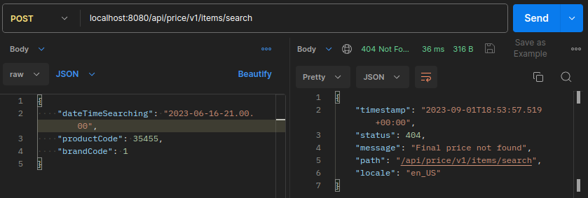
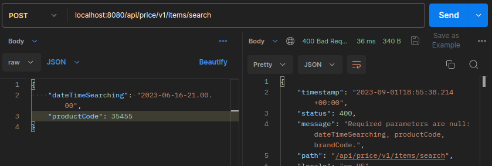

En la base de datos de comercio electrónico de la compañía disponemos de la tabla PRICES que refleja el precio final (pvp) y la tarifa que aplica a un producto de una cadena entre unas fechas determinadas. A continuación se muestra un ejemplo de la tabla con los campos relevantes:

PRICES
-------

BRAND_ID         START_DATE                                    END_DATE                        PRICE_LIST                   PRODUCT_ID  PRIORITY                 PRICE           CURR
------------------------------------------------------------------------------------------------------------------------------------------------------------------------------------------------------------------------------------------
1         2020-06-14-00.00.00                        2020-12-31-23.59.59                        1                        35455                0                        35.50            EUR
1         2020-06-14-15.00.00                        2020-06-14-18.30.00                        2                        35455                1                        25.45            EUR
1         2020-06-15-00.00.00                        2020-06-15-11.00.00                        3                        35455                1                        30.50            EUR
1         2020-06-15-16.00.00                        2020-12-31-23.59.59                        4                        35455                1                        38.95            EUR

Campos:

BRAND_ID: foreign key de la cadena del grupo (1 = ZARA).
START_DATE , END_DATE: rango de fechas en el que aplica el precio tarifa indicado.
PRICE_LIST: Identificador de la tarifa de precios aplicable.
PRODUCT_ID: Identificador código de producto.
PRIORITY: Desambiguador de aplicación de precios. Si dos tarifas coinciden en un rago de fechas se aplica la de mayor prioridad (mayor valor numérico).
PRICE: precio final de venta.
CURR: iso de la moneda.

Se pide:

Construir una aplicación/servicio en SpringBoot que provea una end point rest de consulta  tal que:

Acepte como parámetros de entrada: fecha de aplicación, identificador de producto, identificador de cadena.
Devuelva como datos de salida: identificador de producto, identificador de cadena, tarifa a aplicar, fechas de aplicación y precio final a aplicar.

Se debe utilizar una base de datos en memoria (tipo h2) e inicializar con los datos del ejemplo, (se pueden cambiar el nombre de los campos y añadir otros nuevos si se quiere, elegir el tipo de dato que se considere adecuado para los mismos).

Desarrollar unos test al endpoint rest que  validen las siguientes peticiones al servicio con los datos del ejemplo:

-          Test 1: petición a las 10:00 del día 14 del producto 35455   para la brand 1 (ZARA)
-          Test 2: petición a las 16:00 del día 14 del producto 35455   para la brand 1 (ZARA)
-          Test 3: petición a las 21:00 del día 14 del producto 35455   para la brand 1 (ZARA)
-          Test 4: petición a las 10:00 del día 15 del producto 35455   para la brand 1 (ZARA)
-          Test 5: petición a las 21:00 del día 16 del producto 35455   para la brand 1 (ZARA)


Se valorará:

Diseño y construcción del servicio.
Calidad de Código.
Resultados correctos en los test.


### Soluciòn
1. Clonar el repositorio: `git clone git@github.com:rennydonny/price.git`
2. Bajo el directorio : `cd price`
3. Ejecutar: `./gradlew bootRun`
4. Luego, desde un cliente rest de su preferencia puede pobrar el servicio:
   * url : `http://localhost:8080/api/price/v1/items/search`
   * request as json:
   ```json
   {
   "dateTimeSearching":"2020-06-16-21.00.00",
   "productCode":35455,
   "brandCode":1
   }
   ```
5. Para correr los test unitarios y de integración, bajo el directorio del proyecto ejecutar `./gradlew clean test --info`
6. Para fines prácticos se han colocado los test de integración junto a los unitarios, pero se recomienda separarlos en una directorio por ejemplo `intTest` bajo el directorio `src`
   Ejemplo de ejecuciones:
   1. 
   2. 
7. Ejemplo de pruebas desde postman
   1. [x] Test 1: petición a las 10:00 del día 14 del producto 35455   para la brand 1 (ZARA)
      
   2. [x] Test 2: petición a las 16:00 del día 14 del producto 35455   para la brand 1 (ZARA)
      
   3. [x] Test 3: petición a las 21:00 del día 14 del producto 35455   para la brand 1 (ZARA)
      
   4. [x] Test 4: petición a las 10:00 del día 15 del producto 35455   para la brand 1 (ZARA)
      
   5. [x] Test 5: petición a las 21:00 del día 16 del producto 35455   para la brand 1 (ZARA)
      
   6. [x] Test 6: petición para cualquier día del año 2023
      
   7. [x] Test 7: petición sin atributos mandatorios (BAD REQUEST)
      
